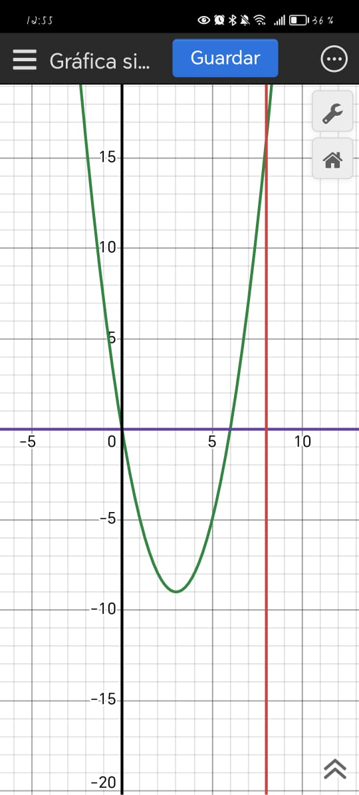
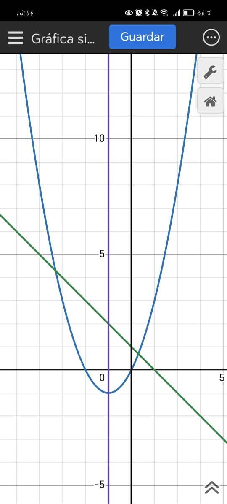
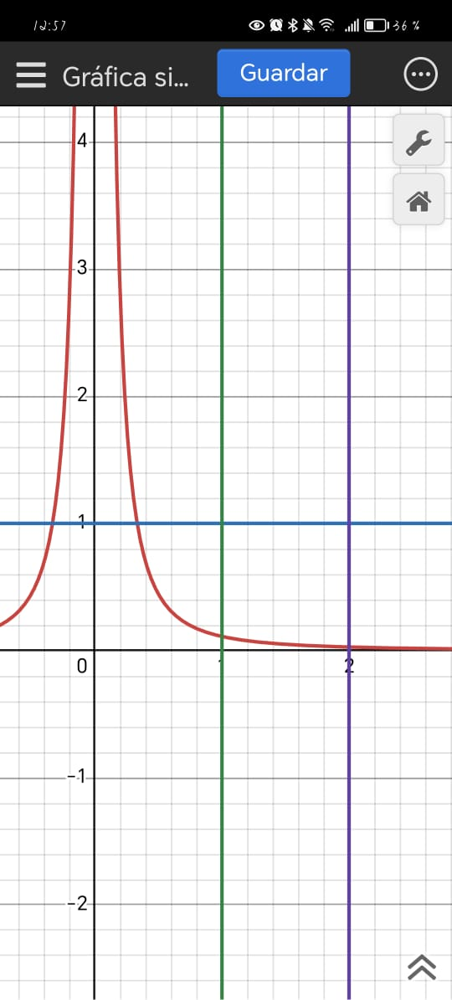
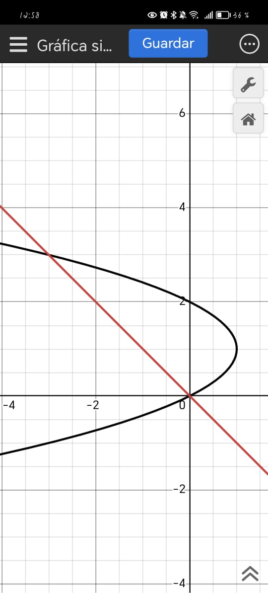

# Solución de Ejercicios de Área con Integrales

## Problema 1
**Funciones:** $y_1 = x^2-6x$, $y=0$, $x=0$, $x=8$

Necesitamos encontrar el área entre la parábola $y_1 = x^2-6x$ y el eje x desde $x=0$ hasta $x=8$.

**Paso 1:** Encontrar dónde: 

$y_1 = 0$

$x^2-6x = 0$

$x(x-6) = 0$

$x = 0$ o $x = 6$

**Paso 2:** Analizar el signo de $y_1$ en el intervalo $[0,8]$

- Para $x \in [0,6]$: $y_1 = x^2-6x \leq 0$ (la función está debajo del eje x)

- Para $x \in [6,8]$: $y_1 = x^2-6x \geq 0$ (la función está arriba del eje x)

**Paso 3:** Calcular el área

$$A = \int_0^6 |x^2-6x| \, dx + \int_6^8 |x^2-6x| \, dx$$

$$A = \int_0^6 -(x^2-6x) \, dx + \int_6^8 (x^2-6x) \, dx$$

$$A = \int_0^6 (-x^2+6x) \, dx + \int_6^8 (x^2-6x) \, dx$$

**Paso 4:** Evaluar las integrales

$$\int_0^6 (-x^2+6x) \, dx = \left[-\frac{x^3}{3} + 3x^2\right]_0^6 = -\frac{216}{3} + 3(36) = -72 + 108 = 36$$

$$\int_6^8 (x^2-6x) \, dx = \left[\frac{x^3}{3} - 3x^2\right]_6^8 = \left(\frac{512}{3} - 192\right) - \left(\frac{216}{3} - 108\right)$$

$$= \frac{512}{3} - 192 - 72 + 108 = \frac{512}{3} - 156 = \frac{512 - 468}{3} = \frac{44}{3}$$

**Respuesta:** $A = 36 + \frac{44}{3} = \frac{108 + 44}{3} = \frac{152}{3}$ unidades cuadradas

::: {.center}
{width=68%}
:::

---

## Problema 2
**Funciones:** $f(x) = x^2-1$, $g(x)=2-x$, $x=0$, $x=1$

Necesitamos encontrar el área entre las curvas $f(x) = x^2-1$ y $g(x) = 2-x$ desde $x=0$ hasta $x=1$.

**Paso 1:** Determinar cuál función está arriba

En $x=0$: $f(0) = -1$, $g(0) = 2$

En $x=1$: $f(1) = 0$, $g(1) = 1$

Como $g(x) > f(x)$ en el intervalo $[0,1]$, el área es:

**Paso 2:** Calcular el área

$$A = \int_0^1 [g(x) - f(x)] \, dx = \int_0^1 [(2-x) - (x^2-1)] \, dx$$

$$A = \int_0^1 (2-x-x^2+1) \, dx = \int_0^1 (3-x-x^2) \, dx$$

**Paso 3:** Evaluar la integral

$$A = \left[3x - \frac{x^2}{2} - \frac{x^3}{3}\right]_0^1 = 3 - \frac{1}{2} - \frac{1}{3} = \frac{18 - 3 - 2}{6} = \frac{13}{6}$$

**Respuesta:** $A = \frac{13}{6}$ unidades cuadradas

::: {.center}
{width=68%}
:::
---

## Problema 3
**Funciones:** $h(x)= \frac{1}{9x^2}$, $y=1$, $x=1$, $x=2$

Necesitamos encontrar el área entre la hipérbola $h(x) = \frac{1}{9x^2}$ y la recta $y=1$ desde $x=1$ hasta $x=2$.

**Paso 1:** Determinar cuál función está arriba

En $x=1$: $h(1) = \frac{1}{9}$, $y=1$

En $x=2$: $h(2) = \frac{1}{36}$, $y=1$

Como $y=1 > h(x)$ en el intervalo $[1,2]$, el área es:

**Paso 2:** Calcular el área

$$A = \int_1^2 [1 - h(x)] \, dx = \int_1^2 \left[1 - \frac{1}{9x^2}\right] \, dx$$

**Paso 3:** Evaluar la integral

$$A = \int_1^2 1 \, dx - \int_1^2 \frac{1}{9x^2} \, dx$$

$$A = [x]_1^2 - \frac{1}{9}\int_1^2 x^{-2} \, dx$$

$$A = (2-1) - \frac{1}{9}\left[-x^{-1}\right]_1^2$$

$$A = 1 - \frac{1}{9}\left(-\frac{1}{2} + 1\right)$$

$$A = 1 - \frac{1}{9} \cdot \frac{1}{2} = 1 - \frac{1}{18} = \frac{17}{18}$$

**Respuesta:** $A = \frac{17}{18}$ unidades cuadradas

::: {.center}
{width=68%}
:::
---

## Problema 4
**Funciones:** $f(y) = y(2-y)$, $i(y)=-y$

Este problema requiere integración respecto a $y$. Necesitamos encontrar el área entre las curvas $f(y) = y(2-y) = 2y-y^2$ e $i(y) = -y$.

**Paso 1:** Encontrar los puntos de intersección

$f(y) = i(y)$

$2y-y^2 = -y$

$2y-y^2+y = 0$

$3y-y^2 = 0$

$y(3-y) = 0$

$y = 0$ o $y = 3$

**Paso 2:** Determinar cuál función está a la derecha

Para $y \in (0,3)$: $f(y) = 2y-y^2 > -y = i(y)$ (verificar con $y=1$: $f(1)=1 > i(1)=-1$)

**Paso 3:** Calcular el área

$$A = \int_0^3 [f(y) - i(y)] \, dy = \int_0^3 [(2y-y^2) - (-y)] \, dy$$

$$A = \int_0^3 (2y-y^2+y) \, dy = \int_0^3 (3y-y^2) \, dy$$

**Paso 4:** Evaluar la integral

$$A = \left[\frac{3y^2}{2} - \frac{y^3}{3}\right]_0^3 = \frac{3(9)}{2} - \frac{27}{3} = \frac{27}{2} - 9 = \frac{27-18}{2} = \frac{9}{2}$$

**Respuesta:** $A = \frac{9}{2}$ unidades cuadradas

::: {.center}
{width=50%}
:::